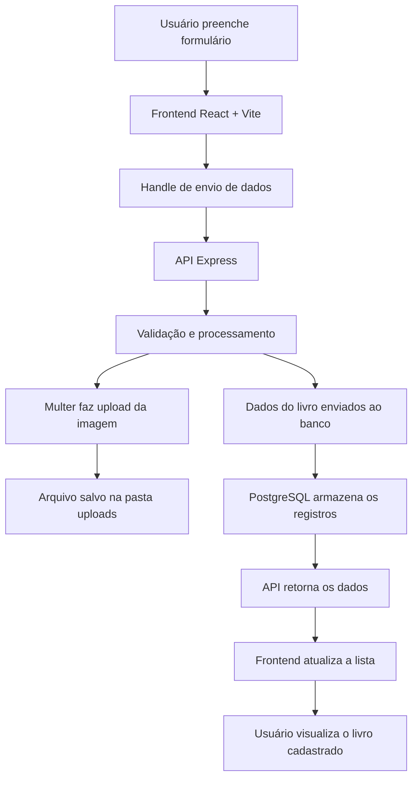

# Lbook

> Um caderno de leituras em evolução, pensado para transformar a experiência de registrar, avaliar e revisitar livros em algo bonito, simples e inteligente.

## ✨ O que é o Lbook?

O Lbook é uma aplicação full-stack criada para ajudar você a organizar sua coleção de leituras com praticidade, personalidade e clareza. A ideia central é simples: cada leitura ganha um espaço próprio para armazenar informações importantes, registrar impressões e construir uma memória de livros que marcaram a sua jornada.

Neste primeiro ciclo, o projeto já entrega uma base sólida para cadastrar livros, avaliar cada obra por categorias, guardar resenhas e acompanhar tudo em uma interface visualmente agradável. O foco agora é evoluir para uma plataforma mais completa, intuitiva e preparada para crescer.

## 🌱 Visão de evolução

O Lbook nasceu como um MVP, mas foi pensado com uma direção clara: virar uma experiência completa de acompanhamento literário. O projeto já passou por uma primeira camada funcional e agora está preparado para receber novas camadas de valor, com foco em organização, personalização e descoberta.

A evolução acontecerá em etapas, começando pela base de cadastro e avaliação, e avançando para recursos que tragam mais contexto, inteligência e experiência ao usuário.

## 🚀 Principais features já implementadas

### 📚 Cadastro de leituras

O usuário pode registrar livros com título, autor e informações básicas, criando um espaço único para cada leitura.

### ⭐ Avaliação por categorias

As avaliações são divididas em quatro categorias principais:

- Enredo
- Personagens
- Edição
- Final

Essa estrutura permite que a nota final seja mais rica e alinhada com o que realmente importa na experiência de leitura.

### 📝 Resenha pessoal

Cada livro pode receber uma resenha, transformando a coleção em algo mais do que uma lista: ela vira um registro de sentimentos, reflexões e memórias.

### 🖼️ Upload de foto da capa

A interface permite anexar uma imagem para representar visualmente o livro e deixar a coleção mais viva.

### 🔄 Edição e remoção

Os registros podem ser atualizados ou removidos sempre que o usuário quiser ajustar a coleção.

## 🧠 Como o fluxo funciona

O fluxo de dados do Lbook segue uma lógica simples e organizada:

```text
Usuário → Frontend (React + Vite) → API (Express) → Banco de dados (PostgreSQL)
```

### Passo a passo

1. O usuário preenche o formulário no frontend.
2. O React captura os dados e envia uma requisição para a API.
3. O backend, em Node.js + Express, recebe os dados e processa o upload da imagem quando houver.
4. O PostgreSQL armazena as informações do livro.
5. A API retorna os dados cadastrados, e o frontend atualiza a lista exibida para o usuário.

## 🔧 Papel de cada tecnologia

- React: responsável pela interface e pela experiência interativa do usuário.
- Vite: fornece uma execução rápida do frontend e um ambiente de desenvolvimento ágil.
- Express: organiza a API REST que recebe, processa e responde às requisições.
- Multer: cuida do upload de arquivos, como a foto da capa do livro.
- PostgreSQL: armazena os dados de forma estruturada e confiável.
- CORS: permite a comunicação segura entre frontend e backend em ambientes locais.

## 🗺️ Fluxograma do fluxo de dados



## 🛣️ Próximas features previstas

As próximas etapas de desenvolvimento foram planejadas para expandir o valor do projeto de forma natural:

### 1. Busca e filtros

Permitir encontrar livros por título, autor, categoria ou nota.

### 2. Organização por status de leitura

Adicionar estados como:

- Quero ler
- Lendo
- Lido
- Abandonei

### 3. Ranking e favoritos

Criar uma área para destacar os livros mais amados, mais bem avaliados ou mais memoráveis.

### 4. Autenticação de usuário

Permitir que cada pessoa tenha sua própria coleção e seus registros privados.

### 5. Histórico de leituras

Registrar datas de leitura, progresso e evolução da avaliação ao longo do tempo.

### 6. Painel de estatísticas

Mostrar métricas como:

- total de livros cadastrados,
- média geral das avaliações,
- categorias mais bem avaliadas,
- livros mais recentes.

### 7. Melhorias na experiência visual

Refinar ainda mais a interface com temas, animações e uma identidade visual mais forte.

## 🧱 Arquitetura proposta para o próximo ciclo

No próximo estágio, o sistema pode evoluir para uma estrutura ainda mais organizada:

- Frontend refinado com componentes reutilizáveis e melhor performance.
- Backend com serviços separados para livros, uploads e autenticação.
- Banco de dados mais preparado para consultas avançadas e relatórios.
- Possível integração com armazenamento em nuvem para imagens.

## 🛠️ Tecnologias utilizadas

- React
- Vite
- Express
- PostgreSQL
- Multer
- CORS

## ▶️ Como rodar localmente

### 1. Instale as dependências

```bash
npm install
```

### 2. Configure o PostgreSQL

Crie um banco chamado `lbook` e certifique-se de que o PostgreSQL esteja rodando localmente.

### 3. Inicie o projeto

```bash
npm run dev
```

Isso sobe o frontend e o backend juntos.

## 📁 Estrutura do projeto

```text
client/      # interface em React
server/      # API em Express
package.json # scripts do workspace
```

## 🌟 Resumo do projeto

O Lbook representa uma ideia simples, mas poderosa: transformar o hábito de registrar leituras em uma experiência organizada, bonita e significativa. O projeto já tem uma base funcional e está preparado para crescer em direção a um produto mais completo, inteligente e envolvente.
